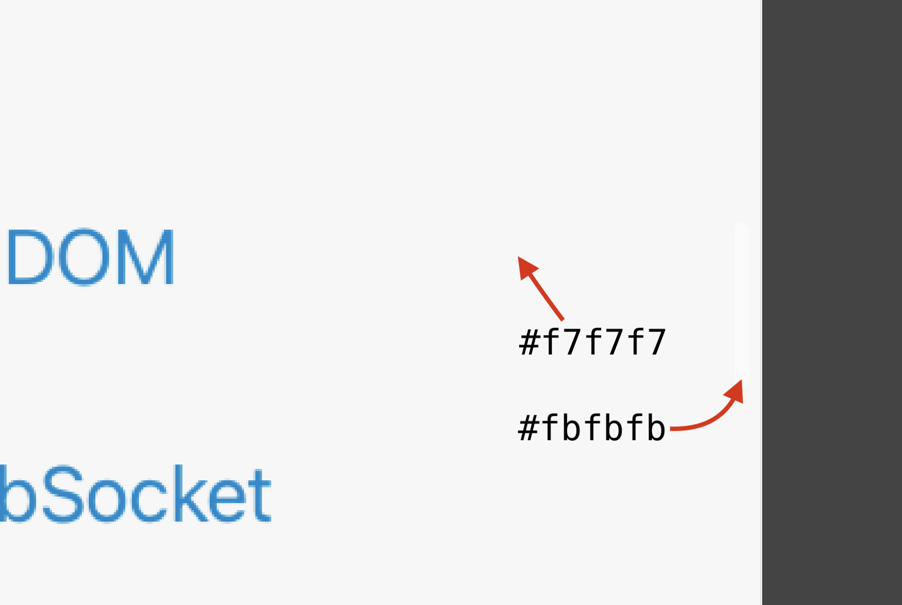

The page scrollbar in web browsers serves a useful function: The vertical position of the scrollbar thumb tells the user where they are in the page (their scroll position), while the size (height) of the scrollbar thumb tells them roughly how long the page is. Because scrollbars are useful, they should be clearly visible.

On Apple’s platforms, most notably on iOS, the page scrollbar is placed inside the viewport and laid on top of web content. In some cases, this can result in a poor contrast between the scrollbar thumb and the page background beneath it. One website that has this problem is [WebKit Blog](https://webkit.org/blog/). The page scrollbar on that website in iOS browsers is almost completely invisible.

<figure>
    
    <figcaption>When scrolling a WebKit Blog article in mobile Safari, the scrollbar is not visible</figcaption>
</figure>

I assure you that there is indeed a scrollbar present in the above screenshot, but don’t worry if you can’t spot it. Even a person with perfect vision could probably not say with certainty that they can see a scrollbar in that image. Let’s zoom in to take a closer look at this supposed scrollbar, and maybe we’ll manage to actually see it this time.

<figure>
    
    <figcaption>Even in this close-up, the scrollbar is only barely visible</figcaption>
</figure>

The contrast ratio between the scrollbar (`#fbfbfb`) and page background (`#f7f7f7`) is 1.03:1. This is only a smidgen above the theoretical minimum of 1:1 (no contrast), which is what you get if you compare a color to itself. For all intents and purposes, the scrollbar is invisible.

<figure>
  <video controls playsinline src="media/invisible-scrollbar-demo.mp4" poster="media/invisible-scrollbar-demo-poster.png"></video>
  <figcaption>Observe how the scrollbar “disappears” as soon as the user scrolls past the page header</figcaption>
</figure>

The invisible scrollbar problem is not specific to iOS. It affects Apple’s other platforms as well. However, macOS users can fix this issue by setting the “Show scroll bars” option to “Always” in system settings (in the Appearance section), which causes the scrollbar to be placed in a separate “scrollbar gutter” outside of the viewport in the browser. There is no such option on iOS, so it’s up to the website to ensure that the page scrollbar is clearly visible.

Websites that are affected by the invisible scrollbar problem can fix this issue by adjusting how they apply CSS background colors to the page. In the future, it will be possible to fix this issue by coloring the scrollbar via the CSS `scrollbar-color` property, which currently isn’t supported in Safari. [Apple has expressed support for this property](https://github.com/WebKit/standards-positions/issues/134#issuecomment-1708699632), but the implementation in WebKit is blocked on a limitation in lower-level frameworks on Apple’s platforms.

```css
html {
  /* A scrollbar with a gray thumb and a transparent track */
  /* Not yet supported in Safari and other WebKit-based iOS browsers */
  scrollbar-color: gray transparent;
}
```

Note that the non-standard CSS `::-webkit-scrollbar` pseudo-elements are not supported on iOS, so they cannot be used as a fallback for the `scrollbar-color` property on that platform.

## What is causing the invisible scrollbar

On WebKit Blog, the header and footer have a dark background, while the main content on the page has a light background. The website achieves this by applying a dark background color to the `<body>` element and a light background color to the `<main>` element.

```css
body {
  background-color: #00253d; /* a dark color */
}

main {
  background-color: #f7f7f7; /* a light color */
}
```

Since the header and footer don’t have their own background color, they are transparent (in CSS, the `background-color` property [defaults](https://drafts.csswg.org/css-backgrounds-3/#propdef-background-color) to the `transparent` value), so the `<body>` element’s dark background is visible through them, resulting in the following appearance:

```html
<body>
  <header>
    <!-- has dark background color -->
  </header>
  <main>
    <!-- has light background color -->
  </main>
  <footer>
    <!-- has dark background color -->
  </footer>
</body>
```

The page scrollbar in web browsers on Apple’s platforms can have a light and dark appearance. The operating system automatically chooses the scrollbar appearance based on the background colors of the web page. Since WebKit Blog sets a dark background color on the `<body>` element, the system assumes that the page is mostly dark and chooses the light scrollbar appearance, resulting in an invisible scrollbar against the `<main>` element’s light background color.

## How to fix this issue

The fix is rather simple. In order to get a dark scrollbar appearance, the page should avoid setting a dark background color on the `<html>` or `<body>` elements. In the case of WebKit Blog, the dark background color should be applied directly to the `<header>` and `<footer>` elements, while the light background color can be applied to the `<main>` element or the `<body>` element (either works).

```css
body {
  background-color: #f7f7f7; /* a light color */
}

header,
footer {
  background-color: #00253d; /* a dark color */
}
```

I should note that this fix can affect the overscroll effect in some browsers. On WebKit blog, when the user scrolls to the top of the page, the overscroll animation creates an impression that the page header is being stretched. In Safari on macOS, this effect is preserved after applying the fix, but in Chrome it isn’t (I [filed a Chromium issue](https://issues.chromium.org/issues/324819919) for this).

<figure>
  <video controls playsinline src="media/overscroll-animation.mp4" poster="media/overscroll-animation-poster.png"></video>
  <figcaption>Safari on the left, Chrome on the right</figcaption>
</figure>

Some people may see this as a (minor) degradation in aesthetics, but I think that an invisible scrollbar is a much bigger problem for users, and websites should prioritize usability over elegance.
